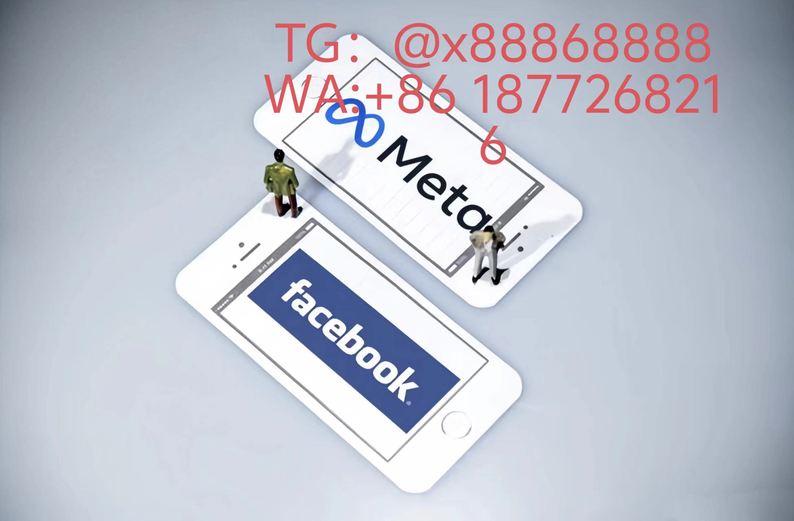

# FB广告效果爆破的6维战争机器
---

## 神经脉冲投放中枢
### 细胞级账户基因库
- **血管型资金通道**：配置三嵌套支付体系（预付账号+后付通道+信用账单）  
- **神经元式BM集群**：建立50+关联BM构成的蜂群网络，自动平衡平台权重  
- **血氧监测模块**：每秒追踪账户健康指数（点击热值/转化血氧/风压系数）  
### 脑区联合作战协议
- 执行前额叶决策层（策略组）+ 基底节执行层（优化师）+ 小脑反射层（AI系统）三脑同步机制  
- 部署神经突触优化算法：每15分钟重构广告DNA链（版位组合-受众映射-素材变异）  
---
## 混沌素材裂变场
### 量子纠缠创意工坊
- **四维素材折叠术**：
空间维：32种分辨率动态适配

时间维：毫秒级场景感知剪辑

交互维：手势热区即时响应

语义维：AI生成500+本地化变体

- 黑洞级吸引模型：在首帧植入μ级视觉钩子（瞳孔扩张触发点）  
### 逆熵增长协议
- 负衰减素材维护体系：设置反脆弱系数自动对抗创意衰退  
- 无限战场扩容机制：每日注入10%完全随机抽象素材测试基因  
---
## 时空折叠投送网
### 引力透镜定位仪
- 构建高密度用户星图：标记2.3亿用户时空坐标（设备型号*网络环境*生物钟相位）  
- 启动超维定位引擎：广告仅在用户决策态叠加时投放  
### 虫洞跳跃算法
- 开发预见性投放系统：提前12小时占领用户信息奇点  
- 部署平行宇宙测试舱：200个虚拟平行账户同步探索流量裂缝  
---
## 免疫屏障铸造厂
### 白细胞防御矩阵
- 建立抗原数据库：持续收集全球876种审核变异毒株特征  
- 合成人工抗体：每份素材携带动态伪装基因片段  
### 血脑屏障系统
- 部署纳米级流量透析仪：过滤异常流量精度达99.9937%  
- 激活记忆T细胞机制：记录每次审核对抗经验形成免疫记忆  
---
## 生态脉冲共振体
### 能量虹吸装置
- 构建跨平台薛定谔漏斗：同步捕捉FB/INS/TikTok用户量子态  
- 发动生态链式反应：在三个平台同时制造信息共振峰  
### 虫洞经济引擎
- 开发时区套利模型：利用全球金融市波动调节不同区域出价策略  
- 部署暗物质结算通道：在支付网关间隙完成跨境资金量子跃迁  
---
## 末日生存兵器库
- **基因备份种子库**：冷冻保存100组已验证广告基因序列  
- **反物质湮灭协议**：紧急清除高风险广告组不留痕迹  
- **曲率驱动逃生舱**：遭遇平台封禁时72小时内重建完整生态

[YouTube视频](https://youtube.com/shorts/rzOT02jra2I?feature=share)
# Facebook
